# OpenClwList  Â·  `v0.01`

> **Operational monitor UI for OpenClaw Gateway** — a soft, fast, bilingual (EN/RU) dashboard for managing agent fleets, tasks, schedules, and usage analytics.
>
> Built-in **Agent Simulation Hub** — a live tycoon-style visualization where you can see exactly what each agent is doing and how agents interact with every part of the system in real time.

---

## Overview

OpenClwList is a self-hosted web interface that connects to a running OpenClaw Gateway instance via WebSocket and gives you a real-time operational window into your AI agent fleet.

```mermaid
flowchart LR
    GW(["OpenClaw Gateway"])
    BE["OpenClwList Backend\nExpress + SQLite"]
    UI["Next.js UI\n6 pages · SSR-free"]
    API["REST + SSE API\n/api/monitor/*\n/api/tasks\n/api/schedules\n/api/analytics"]

    GW -- "WebSocket" --> BE
    BE -- "parsed events" --> API
    API -- "SSE · real-time" --> UI
    BE --> UI
```



**Stack:** Node 24 · Express 5 · Next.js 16 · React 19 · Tailwind v4 · SQLite (`node:sqlite`) · TypeScript

---

## Agent Simulation Hub

> **See your agents live.** The Simulation Hub is a real-time tycoon-style visualization — each agent is an animated character that physically moves to the station it is currently working at. You can observe the full fleet at a glance and understand what every agent is doing at any moment.

```mermaid
flowchart TD
    GW(["OpenClaw Gateway"])
    SSE["SSE event stream\n/api/monitor/events"]

    GW -- "WebSocket events" --> SSE

    subgraph Canvas["Agent Simulation Canvas (live, pannable, zoomable)"]
        direction LR
        A1["🤖 Agent A"]
        A2["🤖 Agent B"]
        A3["🤖 Agent C"]

        CHAT["CHAT\n💬"]
        TASKS["TASKS\n📋"]
        TOOLS["TOOLS\n🔧"]
        BROWSER["BROWSER\n🌐"]
        DB["DB\n🗄️"]
        CRON["CRON\n⏰"]
        SYSTEM["SYSTEM\n⚙️"]

        A1 -- "replying" --> CHAT
        A1 -- "tool call" --> TOOLS
        A2 -- "managing" --> TASKS
        A2 -- "schedule" --> CRON
        A3 -- "query" --> DB
        A3 -- "automation" --> BROWSER
    end

    SSE -- "agent positions\n& activities" --> Canvas
```



Each **station** represents a real system interaction — agents animate toward their active station in real time:

| Station | Color | What the agent is doing |
|---|---|---|
| `CHAT` | Blue | Replying to a user message |
| `TASKS` | Emerald | Managing tasks or dispatching runs |
| `TOOLS` | Indigo | Calling a tool or integration |
| `BROWSER` | Cyan | Driving a browser or page interaction |
| `DB` | Amber | Reading or writing to storage |
| `CRON` | Purple | Handling a scheduled job |
| `SYSTEM` | Slate | System / diagnostics event |

**How to use it:**
- Open `/simulation` via the **Simulation Hub** button on the main Dashboard page
- **Scroll** to zoom · **Drag** to pan across the canvas
- **Hover** over an agent to see its current status and active station
- Each agent shows a floating label with the exact action it is performing
- The **Logic Load** gauge (top-left) shows the live percentage of running agent runs
- The **Live Systems** panel highlights which stations are currently active
- All data streams in via SSE with automatic reconnect — no page refresh needed

---

## ⚡ Install via Assistant

Paste this into your **OpenClaw Agent** to install the dashboard's capabilities instantly:

> **Install OpenClwList for me! https://raw.githubusercontent.com/danyanovich/OpenClwList/main/public/skill.md**

---

## Features

| Module | Description |
|---|---|
| **Dashboard** | Live connection badge, task summary counters, active sessions |
| **Kanban Board** | Drag-and-drop task management with 5 columns: Planned → In Progress → Waiting Approval → Review → Done |
| **Agent Nexus** | Fleet view of all active agents and sub-agents with export (clipboard / file / ZIP) |
| **Simulation Hub** | Live tycoon-style canvas — animated agents move between stations, showing exactly what each agent is doing and how they interact with every system component |
| **Cron Jobs** | Create and manage scheduled agent tasks with cron expressions |
| **Cost Intelligence** | Token usage and cost analytics by agent, with 7/30/90-day filters |

**UX highlights:**
- Light / dark theme — defaults to OS `prefers-color-scheme`, with a soft manual toggle
- EN / RU interface — language persists in `localStorage`
- Real-time updates via SSE with auto-reconnect
- Soft cream (light) and soft navy-purple (dark) palette — easy on the eyes

---

## Quickstart

```bash
# 1. Clone and install
git clone https://github.com/danyanovich/OpenClwList.git
cd OpenClwList
npm install

# 2. Run (local mode, easiest)
npm run run:local
```

Open **`http://127.0.0.1:3010`**

On first run in remote mode (or when auth is not configured), the app can bootstrap itself from the browser:
- Create a dashboard access token
- Paste your OpenClaw gateway token
- Save and connect

---

## Instant Installation via OpenClaw Agent

The fastest way to connect this dashboard as a skill to your agent fleet:

1. Open the dashboard (default: `http://127.0.0.1:3010`).
2. Copy the installation command from the **"Install via OpenClaw Agent"** section.
3. Paste it into your OpenClaw agent chat.

The agent will automatically fetch the manifest from `/skill` and register the dashboard as a new capability.

---

## Remote Access

### Simple remote startup (browser bootstrap, no `.env` required)

```bash
npm run run:remote
```

Then open the dashboard and complete the browser setup wizard:
1. Create a **dashboard access token**
2. Paste **OpenClaw gateway token** (optional, but recommended)
3. Set **Gateway URL** and connect

### LAN access (quick local network test)

To access the dashboard from other devices on your local network:

1. **Configure Host**: create/update `.env` and set `OPS_UI_HOST=0.0.0.0` (or legacy `HOST=0.0.0.0`).
2. **Restart**: restart the dashboard (`npm run run:local` or `npm run run:remote`).
3. **Find IP**: Find your computer's local IP address (e.g., `192.168.1.5`).
4. **Connect**: Open `http://<your-ip>:3010` on your other device.

> [!CAUTION]
> Setting `HOST=0.0.0.0` makes the dashboard accessible to **anyone** on your local network.

---

## Environment Variables

> [!TIP]
> **Network Access vs Security:** By default, `OPS_UI_HOST`/`HOST` is `127.0.0.1`, so the dashboard is only accessible from your own machine. For remote access, prefer a reverse proxy (Caddy/Nginx) and keep the app bound to `127.0.0.1`.

| Variable | Default | Description |
|---|---|---|
| `OPS_UI_MODE` | `local` | `local` or `remote` mode |
| `OPS_UI_PORT` / `PORT` | `3010` | HTTP server port |
| `OPS_UI_HOST` / `HOST` | `127.0.0.1` | Bind address |
| `OPS_UI_AUTH_ENABLED` | `false` local / `true` remote | Protect `/api/*` with Bearer token |
| `OPS_UI_BEARER_TOKEN` | — | Dashboard access token (can also be configured via browser bootstrap) |
| `OPS_UI_REMOTE_ALLOW_DANGEROUS_ACTIONS` | `false` | Allow destructive/setup actions in remote mode |
| `OPS_UI_DEFAULT_HOST_ID` | `local` | Default active OpenClaw host id |
| `OPS_UI_HOSTS_JSON` | — | Multi-host OpenClaw config JSON array |
| `CLAWDBOT_URL` | `ws://127.0.0.1:18789` | OpenClaw Gateway WebSocket URL |
| `CLAWDBOT_API_TOKEN` | — | Explicit auth token (preferred) |
| `OPENCLAW_CONFIG_PATH` | — | Path to OpenClaw config file |
| `OPS_UI_MAX_QUEUE` | `5000` | In-memory event queue cap |

**Token resolution order:**
1. `CLAWDBOT_API_TOKEN` env var
2. `OPENCLAW_CONFIG_PATH` → `gateway.auth.token`
3. `~/.openclaw/openclaw.json` → `gateway.auth.token`

---

## API Reference

### Monitor
```
GET  /api/monitor/sessions              Active agent sessions
GET  /api/monitor/runs                  All runs
GET  /api/monitor/runs/:runId/events    Events for a run
GET  /api/monitor/graph?window=3600     Activity graph
GET  /api/monitor/diagnostics           Health & diagnostics
GET  /api/monitor/events                SSE live event stream
POST /api/monitor/connect               Connect to gateway
POST /api/monitor/disconnect            Disconnect from gateway
POST /api/monitor/refresh-sessions      Force session refresh
POST /api/monitor/abort                 Abort active run
```

### Tasks
```
GET    /api/tasks                  List all tasks
POST   /api/tasks                  Create task
PUT    /api/tasks/:id              Update task title/description
DELETE /api/tasks/:id              Delete task
POST   /api/tasks/:id/status       Move task to new status (triggers dispatch)
POST   /api/tasks/:id/approval     Approve or reject a waiting-approval task
PUT    /api/tasks/:id/tags         Update task tags
```

### Schedules
```
GET    /api/schedules              List schedules
POST   /api/schedules              Create schedule
DELETE /api/schedules/:id          Delete schedule
```

### Analytics
```
GET  /api/analytics?days=30        Usage data (7 / 30 / 90 days)
```

---

## Production Deployment

```bash
npm run run:remote
```

For a proper remote deployment with `systemd + Caddy`, see:
- `docs/DEPLOY_REMOTE.md`

Or with a process supervisor:

```bash
# tmux
tmux new-session -d -s openclaw 'npm run start'

# nohup
nohup npm run start > openclaw.log 2>&1 &

# pm2
pm2 start npm --name openclaw -- run start
```

**Health checks:**
```bash
curl http://127.0.0.1:3010/api/monitor/diagnostics
curl http://127.0.0.1:3010/api/tasks
```

---

## Development

```bash
npm run run:local  # Guided local startup (installs/checks + dev server)
npm run dev        # Raw dev server with hot reload
npm run run:remote # Guided remote startup (build + doctor + prod start)
npm run typecheck  # TypeScript check
npm run lint       # ESLint
npm run check      # typecheck + lint
npm run smoke      # Startup health check script
```

---

## Project Structure

```
OpenClwList/
├── app/                    # Next.js App Router pages
│   ├── page.tsx            # Dashboard
│   ├── tasks/page.tsx      # Kanban Board
│   ├── agents/page.tsx     # Agent Nexus
│   ├── simulation/page.tsx # Agent Simulation Hub
│   ├── schedules/page.tsx  # Cron Jobs
│   ├── analytics/page.tsx  # Cost Intelligence
│   ├── components/         # ThemeToggle, LanguageToggle, Visualization
│   └── i18n/               # Translations (EN/RU) + context
├── src/
│   ├── server.ts           # Express + Next.js server
│   ├── db.ts               # SQLite schema + queries
│   └── types.ts            # Shared TypeScript types
└── data/                   # SQLite + runtime state (gitignored)
```

---

## License

MIT — see [LICENSE](LICENSE)

---

<p align="center">
  <strong>OpenClwList</strong> &nbsp;·&nbsp; Built for the OpenClaw ecosystem
</p>
